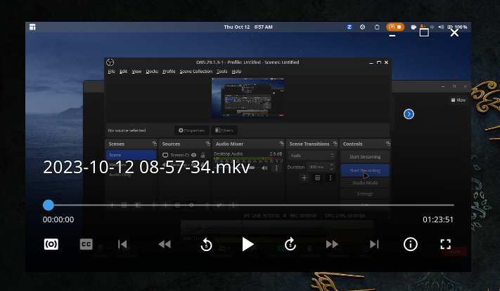

# MPVClean - A Beginner-friendly MPV Custom UI
An MPV OSC (on screen control) script based on [ModernX](https://github.com/cyl0/ModernX) and [mpv-osc-modern](https://github.com/maoiscat/mpv-osc-modern/) that aims to mirror the basic daily use of VLC with a more intuitive interface for MPV. 



# How to install

Locate your MPV folder. It is typically located at `\%APPDATA%\mpv\` on Windows and `~/.config/mpv/` on Linux/MacOS. See the [Files section](https://mpv.io/manual/master/#files) in mpv's manual for more info.

> [!NOTE]
> If you have data in this folder already, please delete it or move it elsewhere (unless you know what you're doing?).

Extract the contents of the zip file into the above-mentioned folder. That's it!

# How to configure
you can edit a LOT of stuff. You can choose custom keyboard shortcuts by editing the input.conf file. You can also edit osc.conf in "\~\~/script-opts/" folder, however many options are changed, so refer to the user_opts variable in the script file for details.

> [!NOTE]
> I have scaled the OSC interface up in windowed mode to make it actually usuable when the video player is small. This scaling may seem rather large if you are playing in a maximized window, but the OSC scaling shrinks IF you play the video in fullscreen. MPV functionality is limited in this regard so I opted in favour of having a usable interface when the video window is small.

# Thumbnails

To enable thumbnails in timeline, install [thumbfast](https://github.com/po5/thumbfast). No other steps are necessary.

# Keyboard Shortcuts
```
spacebar -------- play/pause
right arrow ----- seek +3
left arrow ------ seek -3
shift+right ----- seek +30
shift+left ------ seek -30
m --------------- mute on/off
up arrow -------- add volume +5
down arrow ------ add volume -5
/ --------------- set volume to 100
\ --------------- playback speed -0.25
\ --------------- playback speed +0.25
\ --------------- set playback speed to 1
q --------------- quit (MPV default)
```
# Buttons

The buttons on the OSC bar have multiple functions depending on how you interact with them:

## Seekbar
* Left mouse button: jump to chosen position.
* Right mouse button: jump to the head of chosen chapter (if there are chapters)
## Playlist back/forward buttons
* Left mouse button: play previous/next file.
* Right mouse button: show playlist.
## Skip back/forward buttons
* Left mouse button: go to previous/next chapter.
* Right mouse button: show chapter list.
## Jump back/forward buttons
* Left mouse button: Jumps forwards/backwards by 5 seconds, or by the amount set in `user_opts`.
* Right mouse button: Jumps forwards/backwards by 1 minute.
* Shift + Left mouse button: Skips to the previous/next frame.
## Cycle audio/subtitle buttons
* Left mouse button/Right mouse button: cycle to next/previous track.
* Middle mouse button: show track list.
## Playback time
* Left mouse button: display time in milliseconds (why? I dunno)
## Duration
* Left mouse button: display total time instead of remaining time
